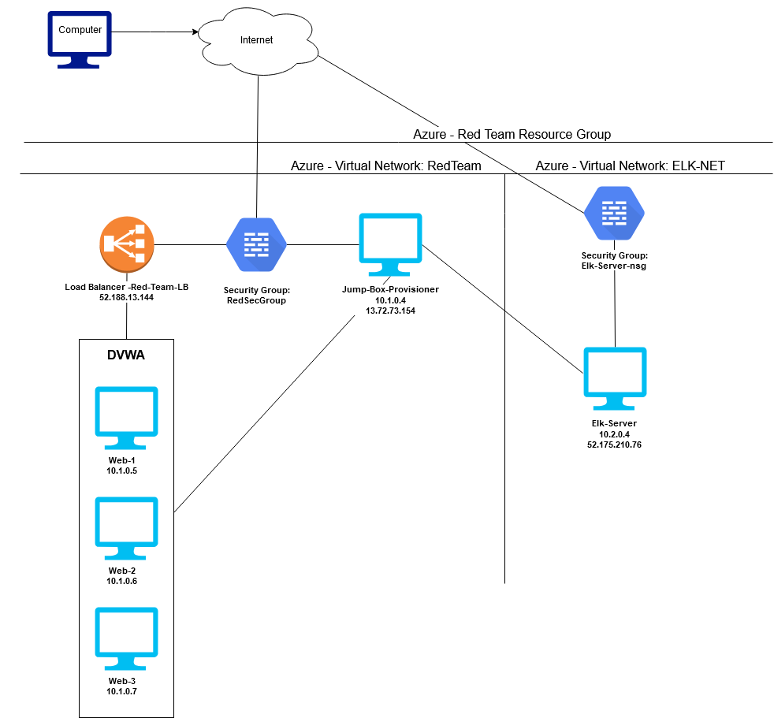
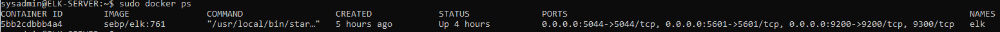

## Automated ELK Stack Deployment

The files in this repository were used to configure the network depicted below.

These files have been tested and used to generate a live ELK deployment on Azure. They can be used to either recreate the entire deployment pictured above. Alternatively, select portions of the playbook file may be used to install only certain pieces of it, such as Filebeat.

This document contains the following details:
- Description of the Topology
- Access Policies
- ELK Configuration
  - Beats in Use
  - Machines Being Monitored
- How to Use the Ansible Build

### Description of the Topology

The main purpose of this network is to expose a load-balanced and monitored instance of DVWA, the D*mn Vulnerable Web Application.

Load balancing ensures that the application will be highly available, in addition to restricting traffic to the network.
- Load Balancers protect against DoS attacks by distributing traffic evenly. The advantage of a Jump Box is it allows you to look at connections coming into just the jump box, rather than each machine.

Integrating an ELK server allows users to easily monitor the vulnerable VMs for changes to the VMs on the network and system system metrics.
- Filebeat watches for changes in the file system.
- Metricbeat records system metrics like CPU usage, disk usage, etc.

The configuration details of each machine may be found below.

| Name     | Function   | IP Address | Operating System |
|----------|------------|------------|------------------|
| Jump Box | Gateway    | 10.1.0.4   | Linux - Ubuntu   |
| Web-1    | Web Server | 10.1.0.5   | Linux - Ubuntu   |
| Web-2    | Web Server | 10.1.0.6   | Linux - Ubuntu   |
| Web-3    | Web Server | 10.1.0.7   | Linux - Ubuntu   |
| ELK      | Monitoring | 10.2.0.4   | Linux - Ubuntu   |

### Access Policies

The machines on the internal network are not exposed to the public Internet. 

Only the jump box machine can accept connections from the Internet. Access to this machine is only allowed from the following IP addresses:
- 172.58.27.37

Machines within the network can only be accessed by Jump-Box-Provisioner.
- Jump-Box-Provisioner is the only VM that has access to the Elk VM. It's public IP is 13.72.73.154, while the network IP is listed above.

A summary of the access policies in place can be found in the table below.

| Name     | Publicly Accessible | Allowed IP Addresses |
|----------|---------------------|----------------------|
| Jump Box | Yes                 | 172.58.27.37         |
| Web-1    | No                  | 10.1.0.4             |
| Web-2    | No                  | 10.1.0.4             |
| Web-3    | No                  | 10.1.0.4             |
| ELK      | No                  | 10.1.0.4             |

### Elk Configuration

Ansible was used to automate configuration of the ELK machine. No configuration was performed manually, which is advantageous because this mitigates variability in configurations.

The playbook implements the following tasks:
- Checks which hosts to start installation on
- Installs and enables docker
- Increases virtual memory to '262144'
- Downloads and launches the Elk container

The following screenshot displays the result of running `docker ps` after successfully configuring the ELK instance.

### Target Machines & Beats
This ELK server is configured to monitor the following machines:
- Web-1: 10.1.0.5
- Web-2: 10.1.0.6
- Web-3: 10.1.0.7

We have installed the following Beats on these machines:
- Filebeat
- Metricbeat

These Beats allow us to collect the following information from each machine:
- Filebeat checks for any changes made to the file system. Metricbeat on the other hand checks for changes in system metrics.

### Using the Playbook
In order to use the playbook, you will need to have an Ansible control node already configured. Assuming you have such a control node provisioned: 

SSH into the control node and follow the steps below:
- Copy the playbook file to the Ansible Control Node.
- Update the hosts file to include the network IPs you want to update.
- Run the playbook, and navigate to the updated VM to check that the installation worked as expected.

- Playbooks:
   - 
   - 
   - 
- In order to have Ansible run on a specific machine, you need to change /etc/ansible/hosts. You have to change the network IPs under the section that the ansible updates (Comment out the IPs not needed for the update). In order to specify which machine you want to install the ELK server on and Filebeat on, you go into the Playbook for either or, and make sure that the 'hosts: ' line in your playbook file matches the hosts you had specified in /etc/ansible/hosts.
- The URL used to check if the ELK server is running is http://52.175.210.76:5601/app/kibana
